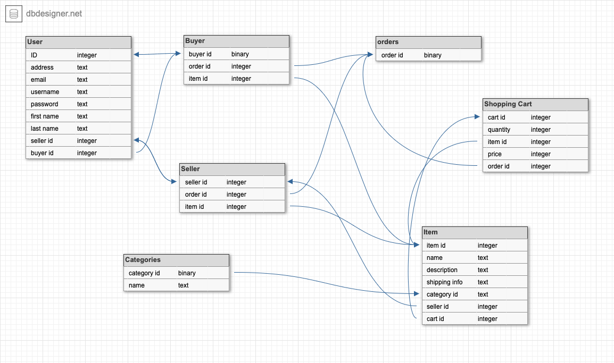

# Q1
#### Describe the architecture of a typical Rails App

Ruby on rails follows a Model View Controller architecture.  Rails is built with the user in mind by following convention above configuration.  This allows rails to make certain decisions that the user will not need to worry about as long as they follow Ruby on Rails convention.

A basic rails architecture contains:

 1. Models
 2. Views
 3. Controllers
 4. Ruby on Rails Server
 5. Routes
 6. Assets


|                |                         |
|----------------|-------------------------------|-----------------------------|
|Models|Ruby classes that communicate with the database.  it is used to store and validate data and complete the applications logic           
|Views |This is what the user sees in the browser.  The view is made up of HTML, CSS and Javascript.  The views will display what the controller sends.            
|Controller| Send the response body ( the HTML, ect...) the rails server takes the data and combines it into an HTTP response that is then sent to the user.
|Routes|Routes help manage URL paths for the app.  The routes also allow the developer to tell which piece of code should handle corresponding requests.
|Server| The ruby on rails server starts a web server.  it will accept requests from the browser.  While you are developing the server listens for requests and lets you access these requests on port 3000 (http://0.0.0.0:3000/)
|Assets|The Assets of the rails app is usually comprised of Javascript code CSS and media, such as images.  This is sent to the browser along with the view.


#### sources:
-  [Source1](https://www.techcareerbooster.com/blog/ruby-on-rails-architecture-overview-for-beginners)
- [Source2](https://betterexplained.com/articles/intermediate-rails-understanding-models-views-and-controllers/)


# Q2
#### Identify a database commonly used in web applications (including Rails) and discuss the pros and cons of this database.

SQLite is a library in C language.  It is a reliable and fast database engine.  It is the most commonly used database.  It has been used successfully with applications like version control systems and record keeping programs, to name a few. SQLite come with rails by default.  It can be used easily with all programming languages.  SQLite offers a relational database management system that is lightweight when it comes to setup and required resources.
Other databases such as PostgreSQl need a seperate server process to operate.  SQLite is self contained and server-less adding to its top features. The serverless nature of SQLite means that the developer does not need to install it before use.
 It is integrated with the application and requires minimal support from an operating system, making it easy to use in many environments like mobile devices and handheld media players.  SQLite also updates content regularly and is less prone to error and bugs.  

|  SQLite              |PROS                         |CONS                        |
|----------------|-------------------------------|-----------------------------|
||Lightweight           |not good with large scaling databases|
||Opensource           |single write at one time( not good for many users working on it at the same time)|
| |no extra configuration|lack of basic functionality(Security, Permission grants ect...)|
||data is in structured tables||
||small file size(less than 1Mb)||


#### sources: 
- [Source1](https://www.trustradius.com/products/sqlite/reviews?qs=pros-and-cons)
- [Source2](https://www.guru99.com/difference-ipv4-vs-ipv6.html)
- [Source3](https://www.sqlitetutorial.net/what-is-sqlite/)


# Q3
#### Discuss the implementation of _Agile_ project management methodology

Agile project management is an approach that is used in modern projects to allow for a flexible way of managing a project.  Software design projects can be unpredictable at times.  An Agile methodology can help teams respond to this in an organised and controlled way.  Agile uses iterative work sequences called sprints.  A Sprint is a certain time that is given to a particular part in a project.  When the time expires the Sprint is complete.  After the sprint there is no more work done on this phase of the project.  
Agile ideas began to surface in the 70's.  The idea was presented by Dr. William Royce.  In his paper he though that software development could be developed similar to a product on an assembly line. The sequences of a project are completed in increments and as each step is completed there is little to no contact between the  groups that finish each stage of the project.

Agile Methodologies include:

 - Agile Scrum
 - Lean Software Development
 - Kanban
 - Extreme Programming
 - Crystal
 - Dynamic Systems Development Method
 - Feature Driven Development

Implementation of Agile Project management steps:

|            |Step                      |Process                     |
|----------------|-------------------------------|-----------------------------|
|1|Strategy meeting to set vision|The meeting helps determine why and what you are trying to accomplish with the project. An Elevator pitch is sometimes used|
|2|Build Product Roadmap|A high level look at the project requirements.  This should include a timeframe for each. |
|3|Release Plan| A agenda for the launch of the working software.  This will usually include many releases with the first having the prioritised features for the launch date.|
|4| Plan out Sprints| This is a closer view of the project where certain tasks and goals will be completed.  A sprint will typically last 1-4 weeks.|
|5| Daily Standups| Through every sprint there needs to be clear communication on any problem that arise and who is working on what.  Daily standups with the team help manage this.
|6|Review|This comes at the end of Sprint cycles.  It is a chance to show a functioning piece of software to the team and key stakeholders|
|7|Sprint Retrospective|this is where the team decides what work to do next once a sprint is done.  It is also a chance to discuss ways to improve for the next project|

#### sources: 
 - [Source1](https://plan.io/blog/ultimate-guide-to-implementing-agile-project-management-and-scrum/)
 - [Source2](https://plan.io/blog/ultimate-guide-to-implementing-agile-project-management-and-scrum/)
 -  [Source3](https://linchpinseo.com/the-agile-method/)
 

# Q4

#### Provide an overview  and description of a standard source control workflow

Source control is a way to track and manage changes to code.  These changes are tracked using tools and source control management.  Source control management will track the changes in the source code repository.  These changes are kept in a history which can be useful when trying to resolve conflicts, which happens when multiple developer updating the same code.
Source control allows developers to maintain an original source of working code while changing features or making update to the code. Source Control Management helps encourage collaboration by allowing many developers to work on the same codebase without overwriting each others work.  This helps accelerate the completion of a project. 
		

#### sources:

- [Source1](https://www.perforce.com/blog/vcs/what-source-control)


# Q5
#### Provide an overview and description of a standard software testing process 

Software testing not only allows a developer to find bugs in their software,  it helps eliminate problems which impact the customer using the software.  One type of software testing is called Black box testing a.k.a behavioural testing.  Black box testing is only concerned with the inputs and outputs in the code.  The approach to this testing means that you are not testing the code itself you are testing the outputs with a given set of inputs.  For example, the tester without knowing the structures of a website can test the webpage.  When the tester uses the browser and provides input (clicks) the outputs can be tested against the expected outcome.

This form of testing simplifies the testing process since the developer is only concerned with the inputs and output of the code.  This method also allows for the testing to be from a users perspective.  The downside to Black-box testing is it can be difficult to design test cases and only a small number of inputs can be tested.  

#### sources: 
- [Source1](http://softwaretestingfundamentals.com/black-box-testing/#:~:text=BLACK%20BOX%20TESTING%2C%20also%20known,%2Dfunctional%2C%20though%20usually%20functional.)
- [Source2](https://usersnap.com/blog/software-testing-basics/)

# Q6
####  Discuss and analyse requirements related to information system security and how they relate to the project

Computers and other digital devices are now considered essential business tools.  This means that the businesses are now at a higher vulnerability for attacks.          When talking about information system security we talk about the processes involved with maintaining confidential information and assuring its integrity.
This not only refers to computer information , but involves protecting data and information in all of its forms.  
Information securities must be considered for any new information system.  When considering what to implement the following requirements should be addressed:

|            |Requirements                      |Process                  |
|----------------|-------------------------------|-----------------------------|
 |1|User Authentication Requirements| Confirming the users authenticity and credentials|
 |2| Access Provisioning| Implementing password management, email authorisation and creation of user accounts
 |3| The Authorisation Process| Determine user permissions and what resources can be accessed|
 |4| Communicating guidelines for user responsibilities when accessing the system| Using memos, emails and websites to communicate guidelines|
 |5| Protecting the system data including availability confidentiality and integrity| controlling user access
 |6| Other security requirements| requiring interfaces to logging and monitoring systems|

#### sources: 			      
- [Source1](https://itservices.uncc.edu/iso/standard-security-requirements-information-systems)
- [Source2](https://en.wikipedia.org/wiki/Information_security#Basic_principles)


# Q7
#### Discuss common methods of protecting information and data and how you would apply them to the project

Common methods of protecting data That wold be implemented include:

 1. Encrypting the data:
	 Data encryption translates a companies data into another form that requires a secret key.
2. Automate security updates:
	This makes sure that the operating systems and other software have the latest security updates.
3. Risk Assessments:  
		Risk assessment helps the team decide what should be performed depended on the seriousness of a data breach.  The higher the risk the more sensitive the data.  
4. Backups:
	A Backup helps prevent data loss.  Regular backups can prevent interruptions to normal business operations due to a data breach.
5. Access Controls:
	Introducing access controls to the workflow effectively reduces the risk.  The less people that have access to the data lessens the danger of a data breach.
6. Destruction:
	Data destruction is more important than it may seem. Properly destroying data protects the company against unwanted recovery and access of the discarded data.

#### sources: 
[Source1](https://digitalguardian.com/blog/101-data-protection-tips-how-keep-your-passwords-financial-personal-information-safe)

[Source2](https://gdprinformer.com/gdpr-articles/6-essential-data-protection-methods)


# Q8
#### Research what your legal obligations are in relation to handling user data and how they can be met for the project


In Australia the policies surrounding privacy and customer data handling is regulated by the Australian Privacy Act, 1988.  The Act is composed of thirteen Privacy Principles.  These principles summarise how companies must manage personal information.

|            |Policy                    |Purpose                 |
|----------------|-------------------------------|-----------------------------|
|1|Transparent management of personal data|organisations must oversee their users data in an transparent way.|
|2|Anonymity and Pseudonymity|organisations must give their users the choice to not identify themselves|
|3|Collection of solicited personal information|This outlines when an organisation is allowed to collect solicited data|
|4|Handling unsolicited personal information|Sets how an organisation handles unsolicited personal user data|
|5|Notifying the user of collection of personal data| Tells and organisation when and in what circumstances the user must be notified of designated matters|
|6|Use or disclosure of personal data|Sets instances where an organisation can or cannot release personal data|
|7|Direct Marketing|Tells the organisation they can only use or disclose personal user data for direct marketing|
|8|Cross border disclosure of personal information| Outlines the steps that can be taken in order to protect personal information|
|9|Adoption, use or disclosure of government identifiers|Describes the circumstances that an organisation can have a government identifier as the identifier of the user|
|10|Quality of personal information|Tells the organisation how reasonable measures must be taken to guarantee the personal user data used is accurate and up to date|
|11|Security of personal information|Tells the organisation that is must take steps to protect the personal data it holds from being abused|
|12|Access to personal information|Tells an organisation when an individual requests access to personal information about them by the organisation| 
|13|Correction of personal information|Outlines the obligations of an organisation when it comes to fixing the information it holds about its users|


- [Source1](https://www.oaic.gov.au/privacy/australian-privacy-principles/australian-privacy-principles-quick-reference/)
- [Source2](https://www.websolutionz.com.au/blog/data-privacy-what-are-your-obligations-in-australia)


# Q9
#### Describe the structural aspects of the relational database model. Your description should include information about the structure in which data is stored and how relations are represented in that structure.

A collection of tables that have unique names.  The rows in a table speak to a relationship in a set of values. This implies a table speaks to an assortment of relationships. The relationships between data are made by means of keys.
In a relational model the tables of data, views and indexes are seperate from the physical storage structures.  This means that when physical data is managed, it can be managed without affecting the access to that data.  For example, when a database file is renamed the file does not rename the tables within it.  A relationship model allows for a one-to-one, one-to-many and many-to-many relationship.


|            |Relationship                   |Description                 |
|----------------|-------------------------------|-----------------------------|
|1|one-to-one|This relationship has only one record on both sides of the relationship|
|2|one-to-many|This relationship has a record on one side and many on the other side|
|3|many-to-many|This relationship has one or many records on one side and one or many on the other side|


#### sources:
- [Source1](https://www2.cs.sfu.ca/CourseCentral/354/zaiane/material/notes/Chapter3/node2.html#:~:text=A%20relational%20database%20consists%20of,mathematical%20concept%20of%20a%20relation.)
- [Source2](https://www.oracle.com/au/database/what-is-a-relational-database/)


# Q10
#### Describe the integrity aspects of the relational database model. Your description should include information about the types of data integrity and how they can be enforced in a relational database.

The maintenance of data and the guarantee of its accuracy and consistency is what makes up data integrity.  Data integrity fails when there are changes to the data, human error and unexpected hardware failure to name a few.  A well defined data integrity system will improve the performance, stability, re-usability and maintainability.  There are two main types of Data Integrity.

|            |Type                  |Description                 |
|----------------|-------------------------------|-----------------------------|
|1|Physical Integrity|This deals with the difficulties that arise with correctly storing and fetching data|
|2|Logical Integrity|This type of integrity takes a piece of data and analyses the correctness of that data. This means the data must make sense in the environment|

There are types of integrity constraints that usually enforce a database system with a set of integrity constraints/rules.
|            |Type                  |Description                 |
|----------------|-------------------------------|-----------------------------|
|1|Entity Integrity|This is the primary key concept. This rule implies that a table needs to have a primary key and it should have unique columns.|
|2|Referential Integrity|This is the foreign key concept.  In this rule a foreign key value can only be in two states.|
|3|Domain Integrity| This rule means that the columns within the database has to be in a defined domain|
|4|User Defined Integrity|This refers to rules that are set by the user.  These rules do not belong in the other integrity categories.|


#### sources:
- [Source1](https://en.wikipedia.org/wiki/Data_integrity)
-  [Source2](https://en.wikipedia.org/wiki/Referential_integrity)


# Q11
#### Describe the manipulative aspects of the relational database model. Your description should include information about the ways in which data is manipulated (added, removed, changed, and retrieved) in a relational database.


Data manipulation statements query data and manipulate it in the schema objects.

|Data Manipulation     |Description            |Syntax                |
|----------------|-------------------------------|-----------------------------|
|INSERT Statement|This is used to add a new row to a table. The statement needs to specify the table where to insert the rows/columns and the values.|``INSERT INTO tableName (column1,column2,...)VALUES(value1,value2...) ``|
|UPDATE Statement|This is used to update rows in existing tables. The statement needs the WHERE condition, which specifies the row to include the update.|``UPDATE tableName SET Column1=value1, Column2=value2...WHERE``|
|DELETE Statement|This statement is used to delete the rows from the tables in the schema|``` DELETE tableName WHERE filterColumn=filterValue ```|
|MERGE Statement|The merge statement is used to select rows from one table into another table.|``WHEN MATCHED--update WHEN NOT MATCHED--insert WHEN NOT MATCHED SOURCE--delete``|


#### source
[Source1](https://www.oracle-dba-online.com/sql/insert_update_delete_merge.htm)

# Q12
#### Identify and explain the workings of TWO sorting algorithms and discuss and compare their performance/efficiency (i.e. Big O)


---

| Sorting Algorithms |                                                                                                                                                                                                                                                                      Description                                                                                                                                                                                                                                                                       |   Best   |     Average     | Worst        |
| :----------------- | :----------------------------------------------------------------------------------------------------------------------------------------------------------------------------------------------------------------------------------------------------------------------------------------------------------------------------------------------------------------------------------------------------------------------------------------------------------------------------------------------------------------------------------------------------: | :----------: | :----------: | :----------- |
|Selection Sort|This algorithm will sort an array by finding the smallest element and putting it in the beginning.  It does this over and over while moving the next smallest element to the second , and so on. Selection sort is well-known for its simplicity and can sometimes perform better than more complicated algorithms.| O(n^2) |O(n^2)|O(n^2
|Bubble Sort|This algorithm is usually used to sort a small number of items or can be used effectively on any length list that is nearly sorted.  This is the most uncomplicated sorting algorithm.  The algorithm works by continuously interchanging the adjacent elements if they are in the wrong order  |O(n)|O(n^2)|O(n^2)|


#### sources
- [Source1](https://en.wikipedia.org/wiki/Bubble_sort)
- [Source2](https://www.geeksforgeeks.org/bubble-sort/)
- [Source3](https://www.geeksforgeeks.org/selection-sort/)
- [Source4](https://en.wikipedia.org/wiki/Selection_sort)


# Q13
#### Identify and explain the workings of TWO search algorithms and discuss and compare their performance/efficiency (i.e. Big O)

A searching algorithm is an algorithm that when given a list of values it compares two of the values and a given value in the list.  Two searching algorithms are Linear search and Binary search:

| Searching Algorithms |                                                                                                                                                                                                                                                                      Description                                                                                                                                                                                                                                                                       |   Best   |     Average     | Worst        |
| :----------------- | :----------------------------------------------------------------------------------------------------------------------------------------------------------------------------------------------------------------------------------------------------------------------------------------------------------------------------------------------------------------------------------------------------------------------------------------------------------------------------------------------------------------------------------------------------: | :----------: | :----------: | :----------- |
|Linear Search| Linear search is also known as sequential search.  This algorithm is a basic search method that checks each element on a list sequentially, once the desired element is located or the list is done. Linear search is easy to implement.  it is also practical when there are only a few items on the list. When there are many values on the same list that need to be searched it is usually better to use a faster method.| O(1) | O(n)| O(1)|
|Binary Search|. Binary search is also known as half-interval search. This algorithm finds the location of a desired value in a sorted array.  It will then compare the value with the middle value of the array.  If the middle element is not equal to the desired value.  If the desired value is less than the middle value then the elements before are kept and the process is repeated until the desired value is found.  If the middle value is greater then the upper half is kept.| O(1)| O(log n) | O(log n)| 

#### sources
- [Source1](https://www.geeksforgeeks.org/binary-search/)
- [Source2](https://en.wikipedia.org/wiki/Linear_search#:~:text=In%20computer%20science%2C%20a%20linear,whole%20list%20has%20been%20searched.)


# Q14
####  Conduct  research  into a marketplace website (_app_) and answer the following parts: 
a. List and describe the software used by the  _app_.
	- Javascript: Java scrip is a lightweight object oriented language.  In conjunction  with HTML and CSS, It is considered one of the main languages of the World Wide Web
	- Node.Js : This platform is made on Chrome's Javascript runtime to build quick and expandable applications
	- Java: A class-based, object-oriented language. It is  explicitly designed to have few implementation dependencies.
	- ES6: Is the 6th version of Javascript.
	- Github: Is known as a repository hosting service.  It also offers version control and source code management using git.
	
b. Describe the hardware used to host the  _app_.   
- Ebay has around 200 databases and 20 search servers.  Each server has between six and twelve microprocessors.  Since EBAY's architecture is a type of grid computing, they can add on servers to the grid as needed.  Ebay has local partners world wide.  These local partners deliver the static data which minimises download time.  This allows millions of users around the globe to search, buy and sell items simultaneously. 

c. Describe the interaction of technologies within the  _app_  
-  **Front-end**: of the app Javascript and Node.js are used.  Node.js uses JavaScript language as the main programming interface.  The Node desktop environment allows the developer to build fast and scalable network applications.  ebay also uses Marko.  Marko is a templating UI library that speeds up the process of building web apps.  All the attributes are in Javascript and works in the server and the browser.
- **Image upload**:  for image uploading, storage and management ebay uses cloudinary.  By using cloudinary ebay does not need to store the images in their servers.  Cloudinary also optimises the images making for faster load speeds on ebay.
- **Back-end**: ebay uses multiple technologies to manage their backend.  Oracle is their database system.  Oracle makes sense for ebay since it is commonly used for online transaction processing and data warehousing.   To manage the data ebay uses Cassandra, which is ideal for its ability to handle large amount of data across many commodity servers.  The software running the servers is Apache Tomcat.  It is an application server which is designed to run Java servlets.

d. Describe the way data is structured within the  _app_  
- eBay's structured data allows users look at their search results and items organised by groupings.  eBay began a new feature in 2016 to their data structure.  They began to have what they called related items.  This feature allows users to see the data they searched for and to discover other items related to what they are viewing.  eBay's structured data pages are keyword based and guide buyers along a shopping journey that is intuitive with the help of browsing modules.  
The structured data surrounding ebays products uses specific identifiers that each seller must associate with their items.  eBay then groups the identifiers so that each listing would be associated with similar products in the eBay catalog.

e. Identify entities which must be tracked by the  _app_  
- Entities which must be tracked by the app includes:
	1. User : Username, Email and Rating
	2. Product : Title, Description, Price
	3. Shopping Cart: Quantity and Cost total
	4. Shipping Information


f. Identify the relationships and associations between the entities you have identified in part (e)  
- User has many orders
- Order has one user
- User has one shopping cart
- Seller has many items
-  Item has one seller
- Item has many categories
- Category has many items  
- Order has one shopping cart
- Shopping cart has many items


g. Design a schema using an Entity Relationship Diagram (ERD) appropriate for the database of this website (assuming a relational database model)





#### sources

- [Source1](https://computer.howstuffworks.com/internet/basics/ebay2.htm#:~:text=When%20you're%20on%20the,is%20left%20in%20the%20auction.)
- [Source2](https://en.wikipedia.org/wiki/JavaScript)
- [Source3](https://stackshare.io/ebay/ebay)
- [Source4](https://en.wikipedia.org/wiki/Oracle_Corporation)
- [Source5](https://stackoverflow.com/questions/1234158/trying-to-understand-ebays-schema)